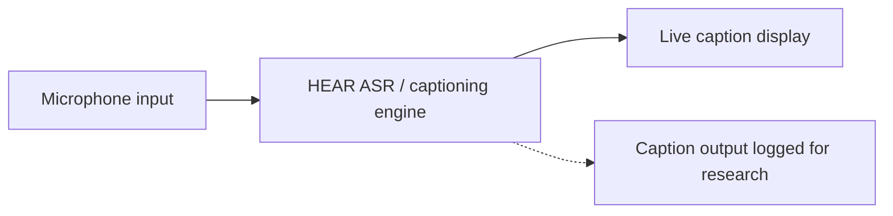
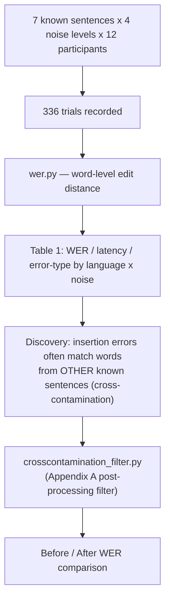

# Architecture

## System overview

HEAR is a browser-based real-time captioning tool with two main modules used
in this study: a speech-to-caption pipeline, and an experience-simulation
module that presents realistic conversational scenarios (classroom,
restaurant, group conversation) used as the noise-condition context.



## Research pipeline (this repository)



## Data flow for reproducing results

```
data/trial_log.csv  ──┐
                       ├──> analysis/run_analysis.py ──> Table 1 numbers + Appendix A before/after
data/error_log.csv  ──┘         (uses wer.py + crosscontamination_filter.py)
```

Every number in the paper's Table 1 and Appendix A is derived directly from
`data/trial_log.csv` by `run_analysis.py` — there is no manual step between
the raw data and the reported statistics, so anyone can re-run the analysis
and get the same numbers.
